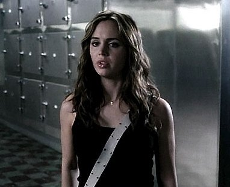

Alias, la meilleure série de tous les temps. L'histoire de Sydney Bristow l'espionne la plus cool de tous les temps et par tous les temps (y compris les pluies d'acide, les vents nucléaires et les orages à haute-tension) et qui doit sauver le monde des méchantes organisations dirigées par les humains parmi les plus géniaux sur l'échelle du Mal. Le vendredi soir sur M6 à partir de vendredi pour ceux qui n'auraient pas encore vu la saison 3. En DVD et en téléchargement sur la Mule pour ceux qui auraient raté la meilleure série de tous les temps. En Janvier 2005 le dimanche soir sur ABC et dès le lundi matin sur Bittorent pour ceux qui, comme moi, attendent de savoir ce que va bien pouvoir inventer Papa Bristow pour expliquer sa présence à Zurich.  

Jeremiah, série découverte il y a peu, je crois d'ailleurs que je vous en ai déjà parlé.  
Jeremiah est un type vivant dans un monde cahotique en pleine reconstruction 15 ans après que tous les êtres humains de plus de 16 ans aient été décimés en quelques semaines par la Grande Mort (une maladie ultra-contagieuse). Disponible sur Série Club en multilingue sur Série Club le vendredi à 20h30 (en conccurence avec ALias donc) le samedi vers 19h et en vost uniquement le mardi à 22h40 (c'est le seul moment où je peux voir cette série pour ma part), avec dans tous les cas, chaque fois deux épisodes.  

Trouvé il y a une deux heures sur Téva, Tru Calling (Compte à Rebours en VF) : l'histoire d'une fille (on reconnaîtra sur l'image ci-dessous qu'elle n'est autre que la méchante Faith qui a oeuvré dans Buffy il y a quelques saisons (et elle a toujours autant de [seins](http://dtcgalerie.free.fr/galleries/Episodes/ep1-00_1-01_Pilot/100-006.jpg))) qui travaille de nuit dans une morgue et qui est appelée par les morts d'une sympathique voix d'outre-tombe qui lui crie "Aide-moi !". Et chaque fois, oh miracle du fantastique, elle a le droit de revenir le même jour le matin pour sauver les morts et quelques autres personnes au passage (dont son frangin doublé par celui qui double le gay dans Dawson). Pour la diffusion, voyez [là](http://trucalling.free.fr/diffusiontv/diffusionfr.php#caldif), c'est trop anarchique pour être simplement expliqué.  

Et sinon, last but not least : Dawson, que l'on ne présente plus, sa mièvrerie adolescente non plus. Personellement, j'adore la première saison, la seconde est pas mal mais à partir du moment où toutes les combinaisons de couple ont été épuisées et que les scénaristes ont commencé à croire qu'il fallait que cette série devienne un cours d'éducation sentimentale (d'ailleurs kassdédi à Flaubert dont le roman, d'après le prof de littérature de Worthington (l'université où bosse Joey) est "un livre où il ne se passe rien, où deux personnages se racontent des souvenirs qu'ils n'ont jamais vécu" (idée qui m'a d'ailleurs séduite indépendamment du fait que je ne lirais pas l'Education Sentimentale, étant incapable de lire les textes classiques)). Tous les jours du lundi au vendredi à 17h15 (selon tf1) ou à 17h25 (selon moi) sur TF1, la sixième (et il me semble dernière) saison. A ne pas rater : le dernier épisode.  
Question subsidiaire : pourquoi la série s'appelle Dawson alors que l'héroïne c'est Joey ?

