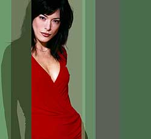

Alors cette semaine (et la semaine dernière) sur les chaînes anglophones vous aviez, au choix :

- Eyes, grosse équipe dégourdie de détectives privés pleins de moyens. C'est plutôt drôle mais là, je n'ai vu que le pilot et je ne sais pas pourquoi, j'ai l'impression que ça va s'essoufler. On notera la présence de Laura Leighton qui a un peu vieilli tout de même mais qui est toujours aussi rousse que dans Beverly Hills. D'ailleurs saluons au passage la performance de la doubleuse française : quand j'ai entendu la voix anglaise de Laura Leighton hors champs je l'ai reconnue (disons aussi que je m'y attendais mais la voix est tout de même pas mal ressemblante). A oui, j'oubliais, c'est sur ABC.

- Hustle, la série désormais culte de BBC One, dont la première saison avait été diffusée sur Paris Première au début de l'année repart pour un tour. L'équipe au grand complet (avec la jolie Jaime Murray (qui a de sacrés faux airs de Liv Tyler par moments)) reprend du service sur une musique toujours aussi agréable à écouter, un peu jazzy sans prétention, dans des situations toujours un peu invraissemblables. Ah oui j'ai oublié de dire de quoi ça parle : une petite équipe d'arnaqueurs professionnels font des arnaques dans la plus pure tradition classique avec toute l'élégance et toute l'intelligence qui caractérisent les anglais.

- Lost, la série la plus regardée depuis X-Files par les américains, a profité de la semaine dernière pour nous dévoiler son 20° épisode (il me semble qu'il y en a 22 et que les deux derniers seront couplés et pas diffusés avant 3 semaines au moins, dur !). C'est dommage qu'on ne voie plus trop Kate (Evangelyne Lili à gauche en dessous (pour ceux avec un petit écran c'est celle du dessus))(j'apprends à l'instant qu'elle parle courament français, ça peut m'aider...). Heureusement que depuis qu'elle parle anglais sans se cacher de son mari, Sun (Yun Jin Kim à droite en dessous) s'est largement embellie. Surtout dans le dernier épisode où on ne la voie que dans l'obscurité et en contre-jour. les scénaristes ont tué Boone, ce qui n'est pas plus mal, depuis qu'il est le petit chien de Locke et qu'il n'arrive pas à se détacher de son amour limite incestueux pour sa demi-soeur, le personnage n'était plus grand chose. On attend que Locke Le Mystérieux (Terry O'Quinn habitué des séries de JJ Abrams (il jouait Kendall dans Alias notament)) nous livre enfin son secret. Mais je ne rêve pas trop, ABC a reconduit Lost en seconde saison et ce serait dommage de repartir avec une mythologie toute neuve l'année prochaine.

- Numb3rs. Ouais, je sais, la dernière fois j'avais dit que c'était naze et que j'abandonnais. Mais bon là je m'ennuie beaucoup trop et il n'y a pas grand chose d'autre à regarder. Dans l'épisode 4, Le Mathématicien Fou modélise un immeuble entier à l'aide d'une ellipse qui a une déviation de 30°. Ouais ! Trop Cool ! CBS et moi donc, c'est pas exactement l'amour... Mais le traitement des personnages est plutôt marrant, on s'y attache un peu. Et puis le père des deux frangins (l'un est mathématicien, l'autre agent du FBI je le rapppelle) est excellent.

Oui, mais demain ?
