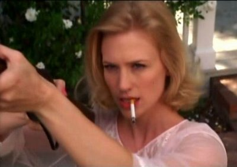

Il est treize heures exactement. Betty Draper est assise dans sa cuisine. En robe de chambre rose, elle fume une cigarette en écoutant la radio pendant que les enfants s'amusent à l'étage. Ses cheveux blonds, lisses comme si son brushing était absolument naturel brillent dans la lumière de l'après-midi.

A l'extérieur, un bruit de colombes et de pigeons qui s'envolent. Ce sont les oiseaux du voisin, Monsieur Wilson. La veille, Paulie, le labrador des Draper a blessé l'un d'entre eux et le voisin a menacé de tuer le chien si il le revoyait approcher de ses protégés.

Betty Draper se lève, attrape un objet hors champs et sort dans le jardin. Elle regarde vers le ciel les oiseaux qui s'élancent vers le ciel bleu. Elle porte sa cigarette au coin de ses lèvres et l'y laisse. Puis lève la carabine (car c'est bien ça qu'elle a attrapé en sortant) et commence à tirer vers le ciel.

Le voisin, effaré, l'interpelle, mais elle fait mine de ne rien entendre. Elle tire, recharge, vise, tire à nouveau vers les oiseaux.

Mad Men,Saison 1, Episode 9
