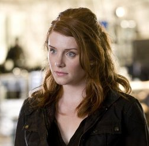

Après avoir enchaîné les trois premiers Terminator (que je n'avais jamais vu, oui, c'est la honte mais c'est comme ça, je suis sûr que vous avez pas vu _Brick_ et ça, c'est la honte aussi) et vu la série, je suis allé voir _Terminator Salvation_ hier.

Et en fait, je crois que c'était le film le plus facile à faire de toute l'histoire du cinéma.

Terminator, c'est un peu comme ce jeu où on vous donne dix mots et il faut en faire une histoire qui tient la route. Déjà, point de départ, faut que ça suive le précédent. Ça c'est facile. Ensuite, il faut qu'un Connor se la joue rebel de la vie. Check. Que le destin de l'humanité repose sur Kyle Reese. Check. « Come with me if you wanna live ». Check. La photo jaunie de Sarah Connor. Check. Le dictaphone de Sarah Connor. Check. « Not a robot. A cyborg. A cybernetic organism.». Check. Une poursuite en camion. Check. Un terminator qui court de manière ridicule après une voiture. Check. Un combat d'un Connor contre un Terminator où se dernier n'a toujours pas compris que balancer au loin son ennemi n'était PAS une tactique efficace pour l'éliminer. Check. Un Connor et un Terminator à moto. Check. « I'll be back ». Check.

J'ai pas de conclusion. Mais j'ai une photo de Kate Brewster. Qui a un fils. Qui va revenir dans le passé pour un reboot de la série dans deux ans. (Si ça arrive, souvenez vous que vous l'avez lu ici en premier).

**edit (06/21/09) :** et je me rends compte à l'instant même que j'ai screenshoté ma souris sur la photo. Je ne sais plus où j'ai trouvé cette image, donc je ne peux pas corriger. Cela dit, je ne l'aurais pas fait de toute manière.

**edit (07/12/09) :** [Nemi gère](http://www.darkitude.com/).
