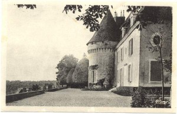

En lisant [Échapper au Mariage - Celui de vos amis - Le votre](http://nologos.net/?p=549) plus tôt dans la journée, je me suis dit que ça tombait tout à fait à pic après la discussion que j'ai eu hier, allongé sur la pelouse du petit parc près de Montgallet à tenter de me colorer un peu la peau, où je comparais les enfants alentours, qui à des rats, qui à des chimpanzés, tous à des daimdaons (le petit du daim) quoique en fait pire puisque le daimdaon met moins d'une semaine à apprendre à marcher là où le bébé humain mets quasiment une année entière.

Cet article sur le mariage m'a également rappelé que je n'ai plus assisté à aucun mariage depuis l'âge de six ans. Celui de mon parrain, il se déroulait à Chanterac, une petite bourgade de province que je serais bien incapable de situer de mémoire sur une carte, tout se dont je me rappelle de cette ville, c'est que tous les panneaux indiquant la direction du village estimait sa distance à quatre kilomètres. Ça et de l'esplanade devant la mairie où un épais tapis de gravillon permettait de faire de grosses traces de dérapage. C'est durant ces vacances là que j'ai lu _Poil de Carotte_ et _Un bon petit diable_ de la Comtesse de Ségur. _Jacquou le Croquant_ faisait partie du voyage mais j'ai jamais pu me résoudre à dépasser la cinquième page depuis.

Je ne me rappelle pas grand chose du mariage lui-même sinon de Capucine, neuf ans, une fille totalement dévergondée pour son âge qui jouait dans les bottes de foin, mangeait des graînes de tournesol à même la fleur, m'a fait monter sur une mobylette et chez laquelle je m'étais fait inviter le lendemain pour manger du pain perdu et aller se baigner à l'Étang. Il me semble que mes grands-parents avaient peur qu'elle ne me viole (je n'ai compris que bien plus tard ce que ce terme signifiait). Dans tous les cas, j'ai un très bon souvenir d'elle en robe jaune en train d'essayer d'aller le plus haut possible sur la balançoire située dans les jardins du chateau où se déroulait l'heureux évènement.

Capucine, si tu te reconnais...

**edit :** c'est exactement là !

