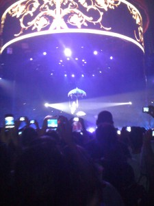

Quand je me suis réveillé ce matin à huit-heure vingt-trois et que j'ai pris ma douche, j'avais plein de phrases percutantes en tête pour décrire le concert de Britney d'hier soir, mais comme chaque fois que j'ai de brillantes idées sous la douche, dès que j'en sors, j'ai irrémédiablement la flemme.

Ça c'est la seule photo valable que j'ai pu prendre avec mon iPhone. En vrai, je voyais son visage distinctement et même son chewing-gum dans sa bouche pendant qu'elle chantait Everytime, mais j'avais laissé mon appareil photo au bureau (un individu mal informé m'avait dit qu'on n'avait pas le droits aux appareils (ce que cette photo dément manifestement)) et l'appareil de l'iPhone est nul.

Sinon, à coup de saturation de basses, même _Mannequin_, une des pires chanson que l'humanité ait connue, était audible (ça fait dix minutes que je cherchais un mot adéquat et je crois que "audible" est celui qu'il fallait). Et j'ai toujours été impressionné par les foules chantant en cœur « My lonelyness is killiiiiiin' me and IIIIIIIIIIIIIII».

Donc c'était pas si mal juste pour voir Britney Spears, mais je me serais bien passé des jongleurs et des acrobates qui ont meublés pendant 45 minutes entre Sliimy et l'arrivée de la Blonde (qui était brune). Limite, j'aurais préféré que Sliimy chante plus longtemps alors que je n'ai aucun goût pour sa musique.

Ce post décousu est sponsorisé par l'Amicale Pour l'Utilisation de Alt-TAB Quand Ton Patron Se Lève.
