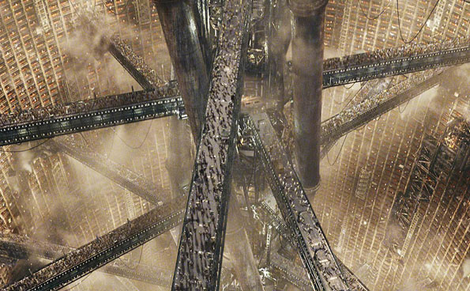

La pluie est enfin là, attendue depuis des jours comme le Messie. Salvatrice, régénératrice, libératrice.

La tristesse latente de ne pas pouvoir aller à Deauville par ce temps est contrebalancée par la joie de la fraîcheur (temporairement) revenue : on voulait aller à l'eau, l'eau est venue à nous, directement par la voie des airs.

Comme tous les dimanche matins, un voisin écoute de l'opéra la fenêtre grande ouverte, mais cette fois-ci, l'œuvre reste inindentifiable, lacérée par le brouhaha des gouttes qui s'écrasent en contrebas dans la cour. J'aime bien le concept de vivre sur cour, comme un succédanée de village vertical. Ça me rappelle ces puits-villes : Zion dans Matrix

ou celle dand laquelle vit John Difool dans les premières heures de l'Incal

J'aime la pluie, faire la vaisselle et me laver les mains. Manipuler la substance première, le "solvant de la vie". Ça me rassérène, mes pensées se fluidifient et circulent nonchalament dans mon esprit, je m'oublie, je divague ("vague !").

À force de côtoyer des gens au libéralisme sentimental exacerbé, je finis par n'avoir plus aucun repère en ce qui concerne les choses de l'amour, du couple et des relations entre les hommes et les femmes. Il y a ceux qui couchent sans aimer, ceux qui s'aiment et en embrassent d'autres, ceux qui s'aiment sans s'être connus et toutes les combinaisons intermédiaires imaginables. Une totale absence de sécurité, une totale liberté. « Peut-on être à la fois libre et en sécurité ? », vous avez quatre heures.

Du coup, maintenant, j'ai soif.
