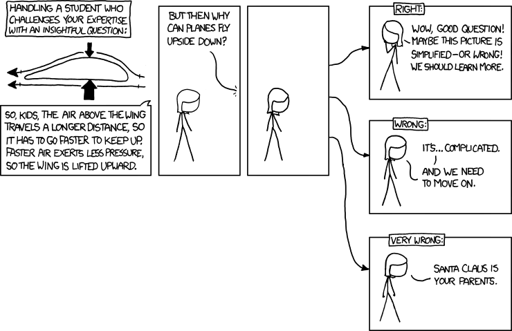

Pour simplifier grandement, je dirai que l'origine du défaut des filles que l'on qualifie généralement de _méga-chiantes_ ou encore de _grosses reloues_ vient essentiellement de leur manque d'une (ou plusieurs) copine et d'une méprise de leur part sur le public auquel elles s'adressent. Cette phrase comporte beaucoup trop d'adverbes, mais c'est volontaire, c'est pour atténuer un propos que je trouve assez (voire complètement) misogyne et que du coup, je n'assume que moyennement.

Genre, mettons que votre amie (qui n'est pas nécessairement votre copine) vous parle d'une robe qu'elle a vu rue des Francs-Bourgeois, l'autre vendredi soir en rentrant de soirée, les projecteurs de la vitrine la faisant ressembler à une apparition divine au milieu de la pénombre de la rue, avec un noeud et des trucs. Je dis des trucs parce que je n'y connais rien en robe, si les robes ça m'intéressait, j'aurai pas pris cet exemple. Oui parce que le fait est, les robes, ça ne m'intéresse pas, comme le maquillage et plein d'autres choses. Si au rang de ces choses il y avait "la sculpture italienne de la Renaissance", on m'accuserait de manque de curiosité, mais on me pardonnerait tout à fait de ne pas trouver un intérêt quelconque dans "pourquoi les avions arrivent-ils à voler à l'envers ?" (alors que objectivement, c'est quand même beaucoup plus intéressant, non ?).

Donc, quand elle fait ça, la jeune fille en question se trompe manifestement de public. Vous êtes sympa alors vous l'écoutez longuement disserter sur la coupe, et comment si elle l'achetait ça résoudrait sûrement tous ses problèmes de couple avec Jérôme. Voilà. En fait, cette robe n'était qu'un prétexte à s'épancher sur ses problèmes de couple avec Jérôme. De toute manière, tout est prétexte à s'épancher sur ses problèmes de couple avec Jérôme. Si ça ne tenait qu'à vous, vous lui diriez de larguer ce connard de Jérôme et de sortir avec Sébastien qui est un mec cool et célibataire. « Nan mais tu comprends, je peux pas le laisser, j'ai construit quelquechose avec lui, il compte, j'aurais l'impression d'avoir gâché ces trois derniers mois de ma vie pour rien et je ne veux pas rester sur une sensation d'échec » répliquerait-elle. En vrai, vous dodelinez de la tête, en espérant qu'au prochain feu (vous êtes tous les deux en train de marcher dans la rue), elle se fasse faucher par un bus.

  
**[Paf le bus](http://www.vodkaster.com/Films/Lolita-malgre-moi/21807)** extrait de [Lolita malgré moi](http://www.vodkaster.com/Films/Lolita-malgre-moi) (j'adore ce film)

Ma prof de philo de Terminale disait qu'une des différences manifeste entre les hommes et les femmes était que les premiers, lorsque confronté à un problème, cherchaient immédiatement à trouver une _solution_, là où les secondes ne cherchaient qu'à le vocaliser, ne considérant pas ce problème comme quelquechose appelant une solution. Votre amie chiante ne veut pas que vous lui suggériez la solution rapide, simple et efficace de larguer Jérémy pour Sébastien, elle veut que vous lui disiez « han mais trop, ce connard de Jérémy, il te mérite pas, sois forte, de toute manière quoi que tu fasses je te soutiens han ». Sauf que je n'ai nullement envie de débiter des sornettes pareilles. Surtout que je sais très bien qu'elle va larguer Jérémy dans trois semaines. Mais vous ne pouvez pas lui dire, ça risquerait de l'énerver encore plus.

La vraie solution donc, serait qu'elle aille s'adresser à un public adéquat, une **copine**. Quelqu'un qui la comprenne et sache faire les répliques toutes faites qu'elle attend à ses non-problèmes.

Mais ne soyons pas complètement misogyne (je rappelle que je n'assume pas), parfois, votre amie chiante se pose aussi des questions auxquelles elle attend des réponses. Les poser à sa _copine_ ne créera que frustration puisque « je te soutiens » n'est PAS une solution applicable. Dans ce cas-là, vous êtes le bon public. Alors soyez un bon public (même si, dans ce cas, c'est elle qui devient rapidement le public) (y a un jeu de mot à faire avec "banc public" mais je ne trouve pas).

