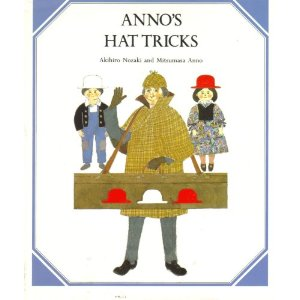

Je date le commencement de mon amour de la logique et des mathématiques lors de la seconde lecture de Jeux de Chapeau de Mitsumasa Anno. Il s'agit d'un petit illustré d'une trentaine de pages pour initier les enfants à la logique mathématique. Ça commence tout doucement pour culminer vers ce problème final :

Un chapelier a cinq chapeaus, trois rouges et deux blancs. Il y a trois participants : Anna, Bob et le Lecteur. Le chapelier demande à chacun de fermer les yeux et dépose sur la tête de chacun d'eux un chapeau. Les autres sont remis dans une malle. Anna, Bob et le Lecteur ne peuvent voir le chapeau qui est posé sur leur tête. Cependant, ils peuvent voir ce que portent les autres.

Le Lecteur, en ouvrant les yeux, constate que Anna porte un chapeau rouge et que Bob également. Le Chapelier demande à Anna si, par la logique, elle peut deviner la couleur du chapeau qu'elle porte. Elle réféchit un instant, puis déclare que non. Il se tourne alors vers Bob et lui pose la même question. Il se gratte le menton quelques minutes et parvient à la conclusion que non, il ne peut rien déduire.

Puis le Chapelier se tourne vers le Lecteur est lui demande de quelle couleur est son chapeau. Toi, Lecteur, peux-tu deviner de quelle couleur est ton chapeau ?

 

Il s'agit maintenant de réfléchir en toute logique. Le chapeau sur ma tête (je me place dans la position du Lecteur) est forcément de l'une ou l'autre des couleurs. Soit Rouge, soit Blanc. Supposons donc qu'il est Blanc. Et reprenons la saynète du début. Plaçons-nous du point de vue de Anna : si mon chapeau est Blanc, celui de Bob étant Rouge, alors évidemment qu'elle ne peut rien dire. Le sien peut être Blanc ou Rouge, elle n'a aucun moyen de deviner. Elle déclare donc qu'elle ne sait pas. Viens le tour de Bob de réfléchir. Ce qu'il voit, c'est mon chapeau Blanc, et le chapeau de Anna supposé Rouge. Il sait en outre qu'elle n'a pas su répondre. Bob, se gratte le menton et fait le raisonnement suivant : Le chapeau qu'il a sur la tête est ou Blanc, ou Rouge. Il peut supposer que son chapeau est Blanc. Mais alors ! Si son chapeau est supposément blanc et que le mien l'est aussi, Anna n'aurait pas dû hésiter : le Chapelier ne possède que deux chapeaux Blancs et si ils sont sur la tête de Bob et la mienne, elle aurait dû deviner qu'elle porte un chapeau Rouge ! Or elle n'a rien dit, donc Bob peut s'exclamer qu'il porte un chapeau Rouge ! Mais voilà bien la contradiction qui apparaît : Bob, dans le cas réel, n'a pu qu'exprimer son ignorance ! C'est donc que l'hypothèse de base fondant la reconstitution de la saynète était fausse. Mon chapeau n'est pas Blanc. Et si il n'est pas Blanc, c'est qu'il est...

Rouge bien sûr !
