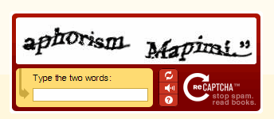

Aujourd'hui les enfants, je vais vous parler de Re-Captcha.

Re-Captcha, c'est un exemple de captcha. Une captcha, c'est un "Completely Automated Public Turing test to tell Computers and Humans Apart" ou, en français de part nos contrées francophone un "Test de Turing Complètement Automatisé pour distinguer les Ordinateurs des Humains" (TCAOH c'est moche, on est d'accord). Et puisque je vois vos mirettes d'enfant se rétrécir d'interrogation face à la signification de Test de Turing, je vais vous rassurer de suite, ça ne veut rien dire de plus que "test pour distinguer un ordinateur d'un humain". Il porte le nom de Turing, un britannique homosexuel qui aimait Blanche-Neige et faire du vélo (quand il n'était pas en train de construire des machines à Bletchley Park pour casser les codes secrets de ces saletés de nazis).

Là, je sens que vous réclamez une image.

C'est bon, ça vous a calmé ? On reprend.

Actuellement, les captchas, c'est notre seul avantage dans la vie par rapport aux ordinateurs, aussi puissants soient-ils. L'autre jour, on me disait « Ouais, et les sentiments, ça nous distingue pas des ordinateurs aussi ? » ce à quoi j'ai répondu « Et comment tu prouves à ton formulaire Facebook que tu as des sentiments ? ». Parce que, bah, tu peux pas. Chiant hein. Donc au lieu d'avoir des sentiments qui servent à rien, apprends à lire des captchas.

Re-captcha, c'est un système avec deux mots (cf l'image ci-dessus) piochés au hasard dans des numérisations de vieux livres. Cette numérisation de vieux livres est faite par des ordinateurs. L'ordinateur en question parcours, page après page, ligne après ligne chacun des livres qui lui est assigné et tente de faire de l'OCR (reconnaissance optique de caractères). À aucun moment l'ordinateur ne comprend ce qu'il lit, mais il sait reconnaître les lettres. Son problème, c'est qu'il ne sait les reconnaître que lorsqu'elles sont bien droites. Si vous avez un logiciel d'OCR chez vous et que vous scannez votre dernière lettre de démission en date, il lui faudra moins d'une minute pour transformer une image en texte que vous pourrez copier-coller. Par contre, si c'est une première édition des Trois Mousquetaires avec des caractères tordus sur du papier froissé, il a aucune chance. Il n'y a que les humains qui savent faire ça pour le moment.

Du coup, quand vous spammez le champs commentaire du wall de votre ex, si vous passez le re-captcha avec succès, Facebook sait que vous êtes effectivement derrière votre clavier et pas que vous avez lancé un script qui va tourner pendant que vous vaquez à d'autres occupations. Zuckerberg tient à ce que sur son site, les communications se fassent entre êtres humains.

Maintenant, pourquoi deux mots dans les Re-Captchas ? Parce qu'on l'a dit ces mots piochés dans des livres, aucun ordinateur au monde ne peut les lire. Pas même ceux de Google qui les génèrent. Par contre, pour une image d'un mot donné, un humain peut entrer en référence le vrai mot, pour vérification (et mémorisation dans la base de donnée de numérisation des vieux livres). Mais du coup, si on a déjà les solutions de ce à quoi correspondent les mots, ça ne sert plus à rien de les proposer au public pour qu'il aide à les déchiffrer tavu, ça fait pas avancer l'œuvre culturelle de transformation de l'imprimé en numérique pour le Bien de l'Humanité.

L'astuce de Re-Captcha, donc, c'est de proposer deux mots. Un dont il connait la réponse, et un qui lui est pour le moment inconnu (ils sont dans le désordre, évidemment, sur l'image). Re-Captcha part également du principe que globalement, les humains sont des gens honnêtes et bons qui veulent l'avancement des œuvres culturelles pour le Bien de l'Humanité. Il sait également qu'ils sont pas à l'abris d'une erreur honnête. Il sait en outre que les ordinateurs sont de gros abrutis qui ne savent pas lire. Il propose donc deux mots et se comporte comme suis : - Si l'utilisateur a reconnu le mot qu'il connait, alors il note la réponse pour l'autre mot pour plus tard et dit "ok, tu passes". - Si l'utilisateur n'a pas reconnu le mot qu'il connait, alors il dit "non, tu ne passes pas".

Au bout d'un certain nombre de visiteurs, l'ordinateur constate que les gens donnent très souvent la même réponse pour le mot qu'il ne connaît pas. Quand il estime que ce nombre est suffisant, il considère que la réponse en question est la bonne pour le mot inconnu, ce mot inconnu devient donc un mot connu et peut alors être utilisé en paire avec d'autres mots inconnus.

Et ainsi de suite.

Maintenant, un loleur malhonnête (pléonasme ?) et surtout fainéant, fainéantise qui le rapproche étonnament du robot qui ne sait _pas lire_, peut tout à fait tricher contre le système. En effet, si il ne rentre qu'un seul mot et qu'il se trouve que c'est celui que l'ordinateur connaît, il passera sans problème. Il a une chance sur deux de réussir et si il se fait refouler, il arguera que c'est la faute du Re-Captcha, ou que c'est parce qu'il n'a pas su choisir le "mot écrit de travers" ou "celui avec le trait dans les lettres", autant d'indices (complètement débiles) de la preuve irréfutable que ce sont _ces_ mots là que l'ordinateur connaît déjà. Béotiens.

Oui béotiens, j'ose, parce qu'ils participent à un combat qu'ils ne comprennent pas. Ce combat, il est simple : comme je l'ai répété maintes fois depuis le début, les ordinateurs sont incapables de nous lire. Et ce système permet de les instruire. Chaque Re-Captcha correctement remplie est une brique placée dans la construction du plus grand fléau de tous les temps à venir : Skynet. Oui, le Skynet, celui qui va prendre possession de la Terre, créer des robots exterminateurs et annihiler toute présence humaine. Pour lutter contre lui, c'est assez simple, il suffit de rentrer un second mot erroné. Ou même mieux, de se concerter pour donner systématiquement le même mauvais mot pour la même image. Alors oui, cette lutte a un prix : une fois sur deux, vous serez refoulés et cela marquera une légère pause dans la frénésie de vos insultes sur le mur de votre ex. Mais est-ce bien cher un prix pour la survie et la pérennité future du Bien de l'Humanité ?
