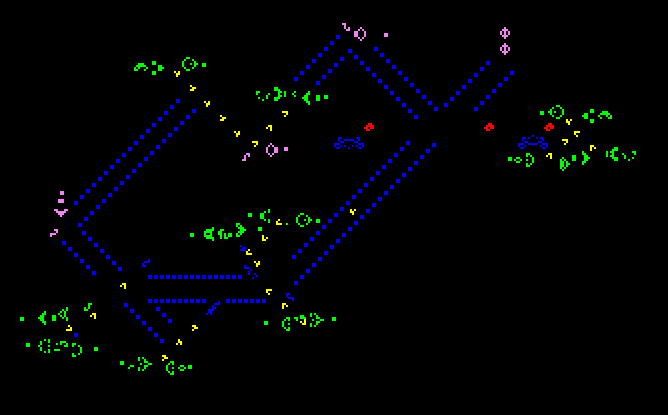

Un jour, en entretien d'embauche, juste avant de me poser des devinettes destinées à évaluer ma capacité à raisonner _out of the box_ (il s'est avéré que sur les quatre devinettes, je connaissais les quatre et que deux d'entre elles ont eu droit à un post dans ces colonnes, on repassera donc pour le _out of the box_) on m'a demandé si, pour moi, un code pouvait être "beau". J'ai été surpris qu'on me pose cette question. C'est une question que j'aurais adoré poser moi-même en entretien, mais je n'ai jamais eu l'occasion d'avoir face à moi quiconque méritait qu'on la lui pose. J'étais flatté donc de la recevoir.

J'ai répondu que oui, un programme pouvait être beau. Puis on m'a demandé pourquoi. Je me suis un peu emmêlé les pinceaux, parce que j'étais stressé d'une part (j'avais envie du poste, c'était une boîte sympa)(spoiler : je l'ai pas eu) et parce que la beauté (je préfère le mot _élégance_ dans ce cas là) est une notion assez fugitive pour que sa définition soit malaisée si l'on est pris au dépourvu.

L'idée la plus importante dans ce qui définit l'élégance d'un morceau de code selon moi, tient dans l'organisation de son exécution. Un morceau de code beau/élégant est sa propre documentation et si une notion purement technique vient à être nécessaire pour le bon déroulement des opérations, cette technicité est clairement isolée et peut tout à fait ne pas être comprise en détail par le développeur suivant sans nuire à la compréhension globale. Vient à cela s'ajouter une autre notion mais qui est plus large et qui s'appliquer à tout un tas de domaines, notament artistique. C'est l'idée que l'œuvre déclarée belle dépasse (ne serait-ce que d'un chouïa) l'intention du créateur. Quand Conway développe l'algo du jeu de la vie, il n'a aucune idée qu'au-delà des règles simples de computation qu'il donne, on va pouvoir en faire ça :

(ce gif me fascine)

Je termine ma définition floue par un « Et pour vous ? » et le mec me répond « Pour moi, c'est beaucoup plus simple, il faut que le programme soit clair et fonctionne ». Je me redresse sur ma chaise  : « Enfin on ne peut tout de même pas dire que

void function void\_function(){}

est une _belle_ fonction si ? Là, on s'ennuie ! » Il a sourit puis a dit « Passons aux devinettes logiques pour voir comment vous réfléchissez face à des problèmes nouveaux. »
