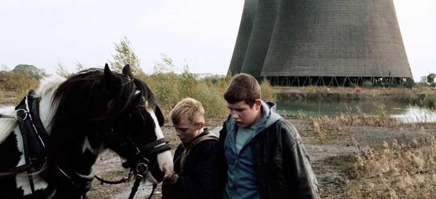

Cette année, j'ai voulu innover dans la continuité et, puisque c'est à la mode de justifier n'importe quoi par les mathématiques, j'ai classé mes films suite à une série de duels en attribuant à chaque gagnant/perdant des points en plus ou en moins en fonction du résultat et de la force des combattants. Ce système, celui qui est utilisé par les joueurs d'échecs pour établir le classement international, celui qu'implémente [Mark "Jesse Eisenberg" Zuckerberg dans The Social Network](http://www.vodkaster.com/Films/The-Social-Network/21287), c'est le Elo Rating System. Pas de favoritisme ni de préjugés : tout le monde est parti de 1400. Le meilleur a fini à 1513, le dernier s'est vu rétrograder à 1286.

Puisqu'on en est à saupoudrer de mathématiques non-significatives : la théorie du tri dit que les meilleurs algo ont une complexité moyenne de n\*log(n) comparaisons : je me suis donc arrêté à 7\*135 = 945 duels (les 20 derniers se sont concentrés sur les 25 premiers du classement, il restait encore beaucoup d'égalité de points, j'ai donc concentré mes efforts sur ceux là) (je trouvais que j'avais déjà assez cliqué pour mettre _Parkland_ en bas du tableau)

Et sans plus attendre, le résultat en image :

1\. Frances Ha (1514) 2. La Vénus à la Fourrure (1513) 3. Effets secondaires (1510) 4. The Hit Girls (1504) 5. The Grandmaster (1503) 6. Borgman (1501) 7. Les Garçons et Guillaume, à table ! (1498) 8. L'Inconnu du lac (1497) 9. World War Z (1496) 10. The Selfish Giant (1495)

11\. Tel Père Tel Fils (1493) 12. The East (1487) 13. La Bataille de Solférino (1483) 14. Mariage à l'anglaise (1482)

15\. Oblivion (1481) 16. 9 mois ferme (1479) 17. Gravity (1476) 18. Le loup de Wall Street (1474) 19. Blind Detective (1471)

 20. Le Congrès (1469) 21. Fast & Furious 6 (1468) 22. 40 ans : mode d'emploi (1463) 23. La Stratégie Ender (1459) 24. 7 Psychopathes (1458) 25. Gatsby le Magnifique (1458) 26. Inside Llewyn Davis (1456) 27. Cloud Atlas (1455)

 28. The Master (1455) 29. Machete Kills (1455) 30. Les Stagiaires (1454)

 31. All is lost (1453)

32\. 20 ans d'écart (1453) 33. The lunchbox (1452) 34. Il était temps (1452) 35. Hunger Games : L'Embrasement (1452) 36. Star Trek Into Darkness (1451) 37. La Maison de la radio (1449) 38. Les Coquillettes (1447) 39. Spring Breakers (1445) 40. This is the end (1442) 41. Je fais le mort (1435) 42. Mud - Sur les rives du Mississippi (1435) 43. Elysium (1433) 44. Evasion (1432) 45. Moi, moche et méchant 2 (1429) 46. Iron Man 3 (1427) 47. Le Passé (1425) 48. La vie d'Adèle (1425) 49. Tian Zhu Ding (JIA Zhangke) (1425) 50. Pacific Rim (1420) 51. Un Chateau en Italie (1420) 52. Lincoln (1419) 53. Percy Jackson : La mer des monstres (1414) 54. Snowpiercer (1414) 55. The Immigrant (1411) 56. The Bling Ring (1410) 57. Les Gamins (1409) 58. Insaisissables (1408) 59. Le Dernier pub avant la fin du monde (1408) 60. Django Unchained (1407) 61. Monstres Academy (1406) 62. A la merveille (1405) 63. Lone Ranger, Naissance d'un héros (1403) 64. Stoker (1402) 65. Thor 2 (1401) 66. No Pain No Gain (1396) 67. Prisoners (1395) 68. La vie domestique (1394) 69. G.I. Joe : Conspiration (1394) 70. L'Homme aux poings de fer (1394) 71. Man of Steel (1394) 72. Red 2 (1391) 73. Warm Bodies (1390) 74. No (1388) 75. Le Monde fantastique d'Oz (1387) 76. La Parade (1386) 77. Belle du seigneur (1385) 78. 100% cachemire (1384) 79. Les Flingueuses (1383) 80. Casse-tête chinois (1383) 81. La Stratégie de la poussette (1380) 82. Albator : Corsaire de l'espace (1378) 83. L'Ecume des jours (1378) 84. Le Monde de Charlie (1377) 85. Only God Forgives (1377) 86. Loulou : L'incroyable secret (1376) 87. Mademoiselle C (1375) 88. Comment j'ai détesté les maths (1374) 89. Vandal (1374) 90. Hôtel Transylvanie (1373) 91. Happiness Therapy (1371) 92. Le cinquième pouvoir (1370) 93. La Danza de la Realidad (1370) 94. Magic Magic (1370) 95. Au bout du conte (1369) 96. Rush (1366) 97. Trance (1362) 98. Les Miller, une famille en herbe (1362) 99. Jimmy P. (Psychothérapie d'un Indien des Plaines) (1361) 100. Dans la tête de Charles Swan III (1361) 101. Heli (1360) 102. Upside Down (1359) 103. Imogene (1355) 104. Alabama Monroe (1355) 105. La Grande Bellezza (1349) 106. R.I.P.D. Brigade Fantôme (1346) 107. Gangster Squad (1345) 108. Jeune & jolie (1345) 109. Les Âmes Vagabondes (1343) 110. Joséphine (1342) 111. Blue Jasmine (1340) 112. Players (1337) 113. Ma vie avec Liberace (1335) 114. Mortal Instruments (1333) 115. Lettre à Momo (1332) 116. Cet Été Là (1331) 117. Malavita (1330) 118. As I lay dying (1329) 119. Die Hard : belle journée pour mourir (1326) 120. Don Jon (1325) 121. Riddick (1324) 122. The Place Beyond the Pines (1323) 123. Sublimes créatures (1319) 124. Hitchcock (1319)

125\. Amour & Turbulences (1318) 126. Foxfire, confessions d'un gang de filles (1316) 127. Les Misérables (1313) 128. My Movie Project (1305) 129. Camille Claudel, 1915 (1301) 130. Cartel (1299) 131. After Earth (1294) 132. Jobs (1292) 133. Passion (1290) 134. Gambit, arnaque à l’anglaise (1289) 135. Parkland (1286)

 

Je suis légèrement déçu que _Le Congrès_, _Oblivion_, _All is Lost_ ou _The Master_ ne soient pas plus haut, mais ils restent en excellente compagnie des élites du Top30.
