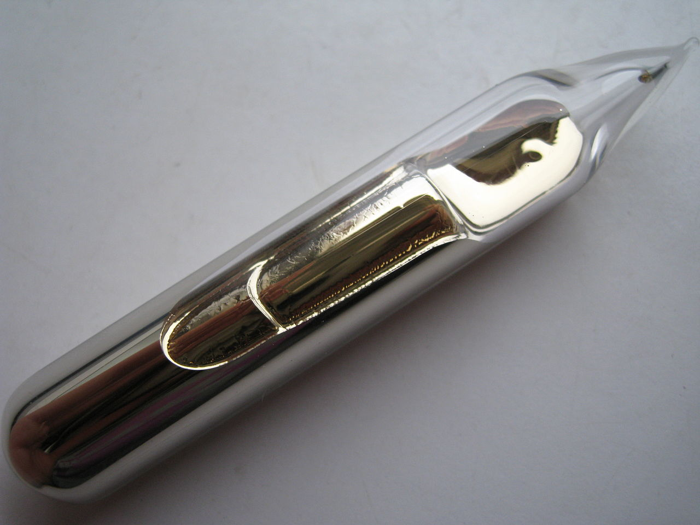
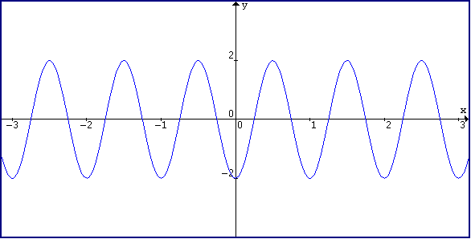
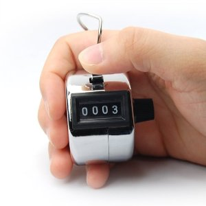

Cet après-midi, Nora demandait sur twitter "[Comment fonctionne une horloge atomique ?](https://twitter.com/norabz/status/448444100728336384)".

Si vous voulez une réponse précise, scientifiquement exacte et vérifiée par la communauté, vous pouvez aller lire la section correspondante sur [Wikipedia](http://en.wikipedia.org/wiki/Atomic_clock#Mechanism). En revanche, si vous voulez une réponse approximative qui implique des chatons et des synthés, vous êtes au bon endroit.

Pour commencer, une précision : une horloge atomique, contrairement à ce que son nom pourrait laisser penser ne se base **_absolument pas_** sur la radioactivité. Un jour, on vous racontera comment on date au carbone14, mais ici on ne veut pas dater des fossiles de 3000 ans, on veut être précis au dix milliardième de seconde.

Imaginons : un stade rempli de chatons, tous identiques. (source Tumblr)Des dizaines de millions de chatons identiques. Ces chatons dorment paisiblement la plupart du temps. Dans la vraie vie, ce sont des atomes de Cesium. Qui sont refroidis à des températures telles qu'ils sont en hibernation la plupart du temps.

Plein d'atome de cesium, ça ressemble à ça (source Wikipedia) C'est vachement moins mignon.

Ces chatons sont d'une race _spéciale_ : quand ils entendent [la note la](http://www.youtube.com/watch?v=buimPG01gcs) (onde sonore de _fréquence_ 440Hz), ça les met dans un état d'excitation pas possible. Ils se mettent à miauler à tout rompre. Par contre, si votre synthé est mal accordé et que vous déviez ne serait-ce qu'un tout petit peu, voire si carrément vous leur diffusez [la note si](http://www.youtube.com/watch?v=YnVJ5PptX-o), ils sombrent à nouveau dans un puissant sommeil.

Dans l'atome de Césium, ça s'appelle un niveau de transition de ses électrons. Et l'atome se met à miauler quand on lui envoie une certaine fréquence de micro-ondes (onde électro-magnétique de _fréquence_ de l'ordre de la dizaine de GHz). Seulement, au lieu de faire vibrer ses petites cordes vocales mignonnes, il fait osciller ses électrons.

Vous, vous êtes l'horloger-robot dans une petite pièce et vous êtes en charge de la petite molette qui accorde le son du synthé qui est diffusé dans tout le stade. Le gros problème, c'est que cette petite molette est hyper-sensible et qu'il suffit d'un courant d'air pour qu'elle tourne toute seule. On a bien essayé de la bloquer avec du Scotch®, mais le Scotch® finit toujours par se décoller. Et personne n'a jugé utile de mettre une graduation.

Donc pour l'éternité, vous passez la totalité de vos journées à réajuster cette petite molette pour que les chatons miaulent en permanence. Ça ne plaît pas aux voisins, mais c'est utile pour les GPS alors vous le faites (et c'est pas comme si vous aviez le choix, vous êtes un robot). Un chaton, c'est tout petit (et mignon), dans un stade vous n'entendriez pas son miaulement, mais si il y en a des dizaines de millions, ça finit par s'entendre jusque dans la cabine dj.

En plus de ça, dès que vous décalez la molette ne serait que d'_un tout petit peu_ ils se remettent à pioncer. Donc c'est pas bien difficile de voir la différence.

Maintenant, une onde de fréquence fixe, qu'elle soit sonore ou électromagnétique, ça se représente comme ça :

C'est une série de vagues qui se déplacent. Dans notre horloge, elles sont toutes canalisées vers une hôtesse de l'air (ou un steward, ça dépend de la marque de l'horloge) munie de cet instrument :

Dont le rôle est de compter le nombre de "bosses" du signal. Dès que le compteur atteint **9 192 631 770** (neuf milliards cent quatre-vingt-douze millions six cent trente-et-un mille sept cent soixante-dix), on rajoute une seconde sur l'écran de notre horloge (ou on bouge la trotteuse, si c'est plus votre truc).

Et voilà, le tour est joué. Vous avez une horloge atomique fabriquée avec des chatons.

Et, à l'instar de ce que wikipédia indique à la fin de son article : _« In practice, the feedback and monitoring mechanism is much more complex than described above. »_
