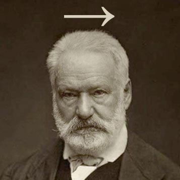

Par curiosité, je me suis penché sur l'exercice réputé "difficile" de l'épreuve du bac de math S de cette année. "Difficile" parce qu'on y [parle d'un tétraèdre](http://www.slate.fr/story/88947/tetraedre-complique-exercice-de-maths-du-bac-s).

J'ai passé mon bac en 2003. Un bac S. [Dont voici l'énoncé](http://gilles.costantini.pagesperso-orange.fr/Lycee_fichiers/bacS2003.pdf)  
Remarquez l'exercice 2 ? Il y a un tétraèdre aussi. Et tout le monde avait hurlé au scandale. Je crois que les tétraèdres sont scandaleux par essence.

\[caption id="attachment\_28085" align="aligncenter" width="357"\] Vecteur Hugo\[/caption\]

À moins que ce ne soit ce tétraèdre particulier.

Pour fuir les papparazzis et les spotlights de la presse people, celui qui en 2003 s'appelait OABC s'appelle désormais ABCD. Mais ne vous laissez pas tromper, c'est bien le même : des triangles isocèles rectangles en le premier point.

Qu'on le pende !

Étant muni d'un intellect hors du commun, je me suis lancé dans l'exercice que j'ai terminé tranquillement en 52 minutes. Je ne suis pas trop sûr de mes justifications aux question 2.b et 2.c ou, pour être plus précis, je ne sais pas si elles tiendraient solidement devant un correcteur de concours d'école (mais elles suffisent très certainement pour un correcteur du bac)

**Note :** on dit que l'épreuve de cette année aurait pu bénéficier d'un schéma du tétraèdre pour aider les élèves. Comme on le constate sur le lien ci-dessus, il y avait un schéma en 2003, ça n'a pas empêché les gens de se planter quand même.
