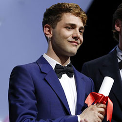
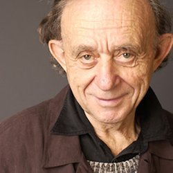
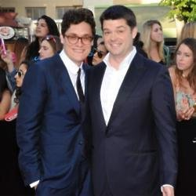
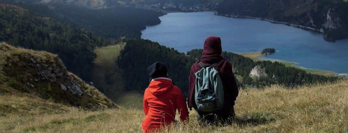
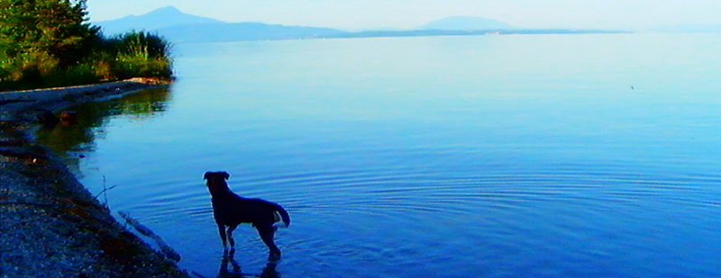
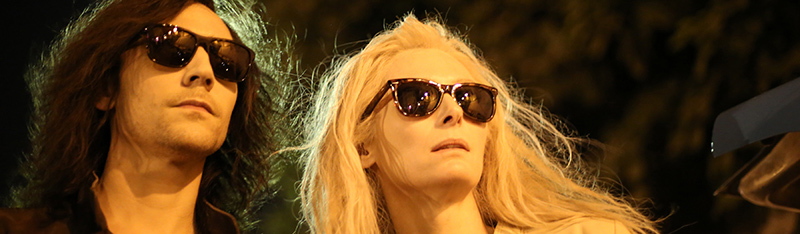
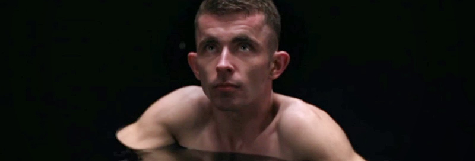
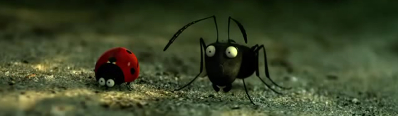

Comme (presque) chaque année, je suis allé plus au cinéma que l'année précédente. Comme chaque fois, je ne tiens compte que des films sortis en salle en 2014. Quelques exceptions 
: - _Veronica Mars_ sorti en direct-to-DVD - _Foxcatcher, Fantasia_ et _Lost River_ que j'ai vu à Cannes et sortent début 2015  

**Top des lieux dans lesquels j'ai vu le plus de films :** 

1 - UGC Cinécité les Halles : 73 films  
2 - Salles du Festival de Cannes : 20 films  
3 - Mk2 Quai de Seine : 14 films  
4 - Mk2 Beaubourg : 5 films  
5 - Mk2 Bibliothèque,Mk2 Quai de Loire : 4 films  
7 - Mk2 Odéon : 3 films  
8 - Max Linder, Grand Action, Mk2 Bastille, Mk2 Hautefeuille : 2 films  
12 - La Pagode, UGC Cinécité La Défense, Reflet Médicis, Forum des Images, UGC Georges V, UGC Bercy, Accatone : 1 film  

**Top des salles de l'UGC les Halles dans lesquelles j'ai vu le plus de films :** 

1 - La 10 : 16 films  
2 - La 6 : 7 films  
3 - La 1 : 6 films  
4 - La 3 : 5 films 
5 - La 4 et la 9 : 4 films  
7 - La 2, la 8 et la 35 : 3 films  
10 - Les 7, 11, 12, 14, 22, 30, 31, 33, 37 : 2 films  
19 - Les 13, 23, 34, 36 : 1 films 

Salles dans lesquelles je n'en ai vu aucun : les salles 5, 20, 21, 24 et 32  

**Top des acteurs que j'ai le plus vu (ou entendu) à l'écran :** 
- Mathieu Amalric dans 5 films : _L'amour est un crime parfait_, _Bird People_, _The Grand Budapest Hotel_, _Arrête ou je continue_ et _La Chambre bleue_ - Scarlett Johansson dans 4 films : _Lucy_, _Under the skin_, _Her_, et _Captain America, le soldat de l'hiver_ - Brady Corbet dans 4 films : _Eden_, _Snow Therapy_, _Sils Maria_ et _Saint Laurent_ - Sarah Gadon dans 4 films : _Et (beaucoup) plus si affinités_, _Enemy_, _Maps to the Stars_ et _The Amazing Spider-Man : le destin d'un 
Héros_ - Tout un tas de gens que j'ai vu (ou entendu) dans 3 films : Stanley Tucci, Bob Balaban, Catherine Deneuve, Matt Damon, Morgan Freeman, Willem Dafoe, Tilda Swinton, Cate Blanchett, Eva Green, Paul Giamatti, Franck Dubosc, Pascal Demolon, Jonah Hill, Jennifer Lawrence, Felix Moati, Anais Demoustier, Chris Pratt, Channing Tatum, Vincent Lacoste, Kristen Wiig, Geraldine Nakache, Stan Lee, Laurent Lafitte, Scoot McNairy, Miles Teller, Vincent Macaigne et Shailene Woodley  

  

**Top des réalisateurs dont j'ai vu le plus de film 
:** - Xavier Dolan : _Tom à la ferme_  
et _Mommy_ - Frederick Wiseman : _At Berkeley_ et _National  
Gallery_ - Chris Miller et Phil Lord : _La Grande Aventure Lego_ et _22 Jump Street_  

 **Top 1 du film le plus vu :** 
_Sils Maria_ vu 3 fois :
- dans la salle Lumière à Cannes le 23 mai, 
- dans la salle 9 de l'UGC les Halles le 27 août
- au Mk2 Hautefeuille le 21 septembre  

**Top des nationalités des films vus 
:** - 63 films  
américains - 45 films  
français - 8 films  
anglais - 4 films  
canadiens - 4 films  
japonais - 2 films  
suédois - 2 films chinois Les autres étaient allemands, maliens, belges, turques, italiens, hong-kongais, israëliens, grecs, suisses, indonésiens et australiens  

 
**Top 5 des films les plus longs** 

1 - _At Berkeley_ (244') 
2 - _Winter Sleep_ (196') 
3 - _National Gallery_ (173') 
4 - _Interstellar_ (169') 
5 - _Transformers : l'âge de l'extinction_ (166')

 **Top 5 des films les plus courts** 
1 - _Adieu au langage_ (70  
2 - _La Chambre bleue_ (75  
3 - _L'ex de ma vie_ (80  
4 - _Obvious Child_ (83  
5 - _SMS_ (84  

**Temps total passé devant des films en salle en 2014** (Note : _Sils Maria_ est compté 3 fois, _Veronica Mars_ ne l'est pas) 10 jours, 20 heures et 8 minutes

Passons maintenant à un peu plus de subjectivité :

 **Top 19 des films réalisés par des femmes** 
1 - _Bird People_ de Pascale Ferran  
2 - _Fidelio, l’Odyssée d’Alice_ de Lucie Borleteau  
3 - _Bande de filles_ de Celine Sciamma  
4 - _Les Gazelles_ de Mona Achache  
5 - _Minuscule - La vallée des fourmis perdues_ de Thomas Szabo et Hélène Giraud  
6 - _Gaby Baby Doll_ de Sophie Letourneur  
7 - _Arrête ou je continue_ de Sophie Fillieres  
8 - _Le procès de Viviane Amsalem_ de Ronit Elkabetz et Shlomi Elkabetz  
9 - _Party Girl_ de Samuel Theis, Marie Amachoukeli et Claire Burger  
10 - _Eden_ de Mia Hansen-Løve  
11 - _Elle l'adore_ de Jeanne Herry  
12 - _Les Merveilles_ de Alice Rohrwacher  
13 - _À coup sûr_ de Delphine de Vigan  
14 - _Still the Water_ de Naomi Kawase  
15 - _Swim Little Fish Swim_ de Ruben Amar et Lola Bessis  
16 - _L'ex de ma vie_ de Dorothée Sebbagh  
17 - _Palo Alto_ de Gia Coppola  
18 - _Tu veux ou tu veux pas_ de Tonie Marshall  
19 - _Sous les jupes des filles_ de Audrey Dana  

 **Top 10 des films américains** 
1 - _Only Lovers Left Alive_ de Jim Jarmusch  
2 - _Her_ de Spike Jonze  
3 - _Edge of Tomorrow_ de Doug Liman  
4 - _At Berkeley_ de Frederick Wiseman  
5 - _Interstellar_ de Christopher Nolan  
6 - _Gone Girl_ de David Fincher  
7 - _A Most Violent Year_ de J. C. Chandor  
8 - _Dallas Buyers Club_ de Jean-Marc Vallee  
9 - _La Grande Aventure Lego_ de Chris Miller,Phil Lord  
10 - _Wrong Cops_ de Quentin Dupieux  

 **Top 10 des films français** 
1 - _Sils Maria_ de Olivier Assayas  
2 - _Bird People_ de Pascale Ferran  
3 - _Fidelio, l’Odyssée d’Alice_ de Lucie Borleteau  
4 - _Les combattants_ de Thomas Cailley  
5 - _Bande de filles_ de Celine Sciamma  
6 - _Une nouvelle amie_ de Francois Ozon  
7 - _Astérix : Le Domaine des Dieux_ de Alexandre Astier et Louis Clichy  
8 - _Les Gazelles_ de Mona Achache  
9 - _Minuscule - La vallée des fourmis perdues_ de Thomas Szabo et Hélène Giraud  
10 - _Pas son genre_ de Lucas Belvaux  

 **Top 10 des films du reste du monde** 
1 - _Mommy_ de Xavier Dolan  
2 - _Under the skin_ de Jonathan Glazer  
3 - _Timbuktu_ de Abderrahmane Sissako  
4 - _Tom à la ferme_ de Xavier Dolan  
5 - _Et (beaucoup) plus si affinités_ de Michael Dowse  
6 - _Le procès de Viviane Amsalem_ de Ronit Elkabetz et Shlomi Elkabetz  
7 - _Deux jours, une nuit_ de Jean-Pierre et Luc Dardenne  
8 - _Zero Theorem_ de Terry Gilliam  
9 - _Xenia_ de Panos H. Koutras  
10 - _Snow Therapy_ de Ruben Östlund  

 

**Top des films d'animation** 

1 - _Astérix : Le Domaine des Dieux_ de Alexandre Astier et Louis Clichy  
2 - _La Grande Aventure Lego_ de Chris Miller et Phil Lord  
3 - _Minuscule - La vallée des fourmis perdues_ de Thomas Szabo et Hélène Giraud  
4 - _Le Conte de la princesse Kaguya_ de Isao Takahata  
5 - _Dragons 2_ de Dean Deblois  
6 - _M. Peabody et Sherman : Les Voyages dans le temps_ de Rob Minkoff  
7 - _Le vent se lève _ de Hayao Miyazaki  
8 - _Tarzan_ de Reinhard Klooss  

**Top 5 des films largement surcôtés** 

1 - _Boyhood_    
2 - _À la recherche de Vivian Maier_    
3 - _12 years a slave_    
4 - _Jacky au Royaume des filles_    
5 - _Hippocrate_    

Mais trêve de bavardage, voilà le top global !

## Top 139 des films vus en 2014

1 - _Sils Maria_ de Olivier Assayas  
2 - _Only Lovers Left Alive_ de Jim Jarmusch  
3 - _Her_ de Spike Jonze  
4 - _Bird People_ de Pascale Ferran  
5 - _Fidelio, l’Odyssée d’Alice_ de Lucie Borleteau  
6 - _Edge of Tomorrow_ de Doug Liman  
7 - _At Berkeley_ de Frederick Wiseman  
8 - _Les combattants_ de Thomas Cailley  
9 - _Bande de filles_ de Céline Sciamma  
10 - _Mommy_ de Xavier Dolan  
11 - _Under the skin_ de Jonathan Glazer  
12 - _Interstellar_ de Christopher Nolan  
13 - _Une nouvelle amie_ de Francois Ozon  
14 - _Astérix : Le Domaine des Dieux_ de Alexandre Astier et Louis Clichy  
15 - _Gone Girl_ de David Fincher  
16 - _A Most Violent Year_ de J. C. Chandor  
17 - _Dallas Buyers Club_ de Jean-Marc Vallée  
18 - _Les Gazelles_ de Mona Achache  
19 - _La Grande Aventure Lego_ de Chris Miller et Phil Lord  
20 - _Minuscule - La vallée des fourmis perdues_ de Thomas Szabo et Hélène Giraud  
21 - _Pas son genre_ de Lucas Belvaux  
22 - _Gaby Baby Doll_ de Sophie Letourneur  
23 - _Lucy_ de Luc Besson  
24 - _Timbuktu_ de Abderrahmane Sissako  
25 - _Arrête ou je continue_ de Sophie Fillieres  
26 - _Wrong Cops_ de Quentin Dupieux  
27 - _Tom à la ferme_ de Xavier Dolan  
28 - _Et (beaucoup) plus si affinités_ de Michael Dowse  
29 - _Whiplash_ de Damien Chazelle  
30 - _John Wick_ de David Leitchet Chad Stahelski  
31 - _22 Jump Street_ de Chris Miller et Phil Lord  
32 - _Le procès de Viviane Amsalem_ de Ronit Elkabetzet Shlomi Elkabetz  
33 - _Deux jours, une nuit_ de Jean-Pierre et Luc Dardenne  
34 - _The Grand Budapest Hotel_ de Wes Anderson  
35 - _Zero Theorem_ de Terry Gilliam  
36 - _Xenia_ de Panos H. Koutras  
37 - _Le Labyrinthe_ de Wes Ball  
38 - _Maps to the Stars_ de David Cronenberg  
39 - _La Vie rêvée de Walter Mitty_ de Ben Stiller  
40 - _Snow Therapy_ de Ruben Östlund  
41 - _Tonnerre_ de Guillaume Brac  
42 - _Divergente_ de Neil Burger  
43 - _Blue Ruin_ de Jeremy Saulnier  
44 - _Enemy_ de Denis Villeneuve  
45 - _Adieu au Langage_ de Jean-Luc Godard  
46 - _Computer chess_ de Andrew Bujalski  
47 - _Obvious Child_ de Gillian Robespierre  
48 - _Blackout Total_ de Steven Brill  
49 - _We are the best!_ de Lukas Moodysson  
50 - _Fiston_ de Pascal Bourdiaux  
51 - _Les Gardiens de la Galaxie_ de James Gunn  
52 - _Party Girl_ de Samuel Theis, Marie Amachoukeli et Claire Burger  
53 - _Hunger Games - La Révolte 1ère Partie_ de Francis Lawrence  
54 - _Trois coeurs_ de Benoit Jacquot  
55 - _Saint Laurent_ de Bertrand Bonello  
56 - _Night Call_ de Dan Gilroy  
57 - _Eden_ de Mia Hansen-Løve  
58 - _Métamorphoses_ de Christophe Honoré  
59 - _The Spectacular now_ de James Ponsoldt  
60 - _Black Coal_ de Diao Yinan  
61 - _Le Conte de la princesse Kaguya_ de Isao Takahata  
62 - _Dragons 2_ de Dean Deblois  
63 - _La Chambre bleue_ de Mathieu Amalric  
64 - _Real_ de Kiyoshi Kurosawa  
65 - _Maestro_ de Lea Fazer  
66 - _Un Homme très recherché_ de Anton Corbijn  
67 - _Winter Sleep_ de Nuri Bilge Ceylan  
68 - _Libre et assoupi_ de Benjamin Guedj  
69 - _La Planète des singes : l'affrontement_ de Matt Reeves  
70 - _Tristesse Club_ de Vincent Mariette  
71 - _Elle l'adore_ de Jeanne Herry  
72 - _Godzilla_ de Gareth Edwards (II  
73 - _National Gallery_ de Frederick Wiseman  
74 - _Captain America, le soldat de l'hiver_ de Anthony et Joe Russo  
75 - _The Amazing Spider-Man : le destin d'un Héros_ de Marc Webb  
76 - _SMS_ de Gabriel Julien-Laferriere  
77 - _The Raid 2_ de Gareth Evans  
78 - _L'Homme qu'on aimait trop_ de Andre Techiné  
79 - _American Bluff_ de David O. Russell  
80 - _Les Merveilles_ de Alice Rohrwacher  
81 - _Magic in the Moonlight_ de Woody Allen  
82 - _The Rover_ de David Michod  
83 - _Near Death Experience_ de Benoit Délépine et Gustave Kervern  
84 - _M. Peabody et Sherman : Les Voyages dans le temps_ de Rob Minkoff  
85 - _Dans la cour_ de Pierre Salvadori  
86 - _À coup sûr_ de Delphine de Vigan  
87 - _Sexy Dance 5 - All in Vegas_ de Trish Sie  
88 - _Still the Water_ de Naomi Kawase  
89 - _The Two Faces of January_ de Hossein Amini  
90 - _Swim Little Fish Swim_ de Ruben Amar et Lola Bessis  
91 - _La French_ de Cedric Jimenez  
92 - _Yves Saint Laurent_ de Jalil Lespert  
93 - _Ninja Turtles_ de Jonathan Liebesman  
94 - _Une autre vie_ de Emmanuel Mouret  
95 - _Jacky au Royaume des filles_ de Riad Sattouf  
96 - _Dans l'ombre de  Mary - La promesse de Walt Disney_ de John Lee Hancock  
97 - _X-Men : Days of Future Past_ de Bryan Singer  
98 - _Transformers : l'âge de l'extinction_ de Michael Bay  
99 - _Robocop_ de Jose Padilha  
100 - _The Giver_ de Phillip Noyce  
101 - _The Ryan Initiative_ de Kenneth Branagh  
102 - _Hippocrate_ de Thomas Lilti  
103 - _Veronica Mars_ de Rob Thomas  
104 - _White Bird_ de Gregg Araki  
105 - _Situation amoureuse : C'est compliqué_ de Manu Payet et Rodolphe Lauga  
106 - _La crème de la crème_ de Kim Chapiron  
107 - _L'ex de ma vie_ de Dorothée Sebbagh  
108 - _300 : La naissance d'un Empire_ de Noam Murro  
109 - _Foxcatcher_ de Bennett Miller  
110 - _Pride_ de Matthew Warchus  
111 - _47 Ronin_ de Carl Rinsch  
112 - _The Search_ de Michel Hazanavicius  
113 - _Detective Dee 2 : La Légende du Dragon des Mers_ de Tsui Hark  
114 - _Palo Alto_ de Gia Coppola  
115 - _L'amour est un crime parfait_ de Jean-Marie et Arnaud Larrieu  
116 - _Jimmy's Hall_ de Ken Loach  
117 - _Fantasia_ de Wang Chao  
118 - _Philomena_ de Stephen Frears  
119 - _Le Hobbit : La Bataille des 5 Armées_ de Peter Jackson  
120 - _Le Rôle de ma vie_ de Zach Braff  
121 - _Tu veux ou tu veux pas_ de Tonie Marshall  
122 - _Boyhood_ de Richard Linklater  
123 - _Monuments Men_ de George Clooney  
124 - _Apprenti gigolo_ de John Turturro  
125 - _Le vent se lève_ de Hayao Miyazaki  
126 - _Exodus : Gods and Kings_ de Ridley Scott  
127 - _Transcendance_ de Wally Pfister  
128 - _Sin City : j'ai tué pour elle_ de Robert Rodriguez,Frank Miller  
129 - _Qu'est-ce qu'on a fait au Bon Dieu ?_ de Philippe De Chauveron  
130 - _12 Years a Slave_ de Steve McQueen (II  
131 - _Sous les jupes des filles_ de Audrey Dana  
132 - _Lost River_ de Ryan Gosling  
133 - _'71_ de Yann Demange  
134 - _A la recherche de Vivian Maier_ de John Maloof et Charlie Siskel  
135 - _Barbecue_ de Eric Lavaine  
136 - _New York Melody_ de John Carney  
137 - _Tarzan_ de Reinhard Klooss  
138 - _The Canyons_ de Paul Schrader  
139 - _Vampire Academy_ de Mark Waters  
