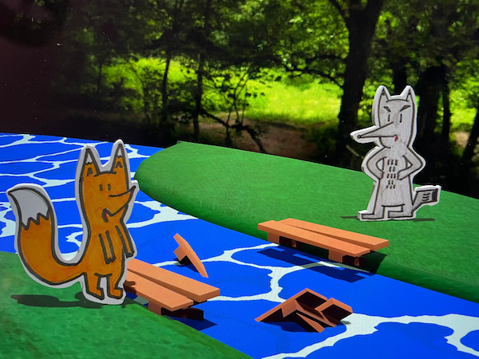
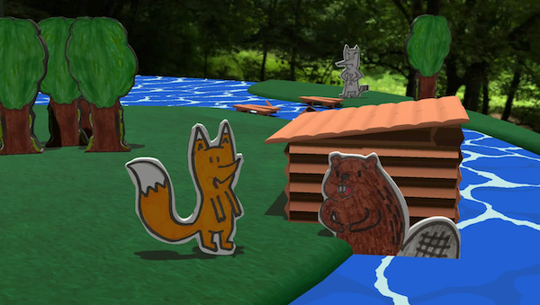
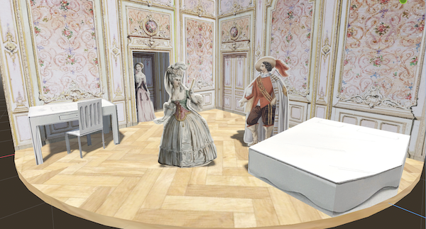
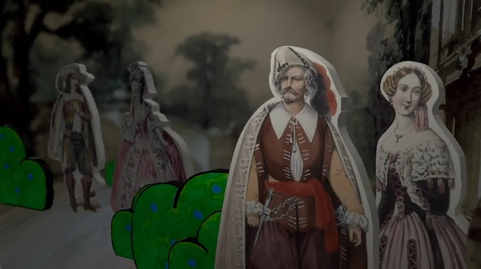

_post initialement publié sur [linkedin](https://www.linkedin.com/pulse/tu-fais-quoi-en-ce-moment-julien-julien-zamor-kq7ve/)_

« Tu fais quoi en ce moment, Julien ? »

Vous êtes nombreuses et nombreux à me poser la question, alors je me suis dit que peut-être je parlais pas assez de mon actu professionelle sur le réseau social de l'actu professionelle.

D’abord, pour ceux qui n’ont pas tout suivi, j’ai quitté Citio/RATPDev après cinq années de bons et loyaux services en tant que CTO à manipuler de la donnée et de l’intelligence humaine et articifielle pour optimiser les transports en communs divers et variés du monde entier.

C’était une expérience enrichissante, j’ai beaucoup appris en culture produit, en agilité, en scalabilité, en management et rencontré des personnes formidables ; mais les derniers mois furent éprouvant et le repos, nécessaire !

Un repos assorti de la réflexion qu’il n’était jamais trop tard pour se lancer dans de nouvelles aventures longtemps repoussées ! (C’est la composante “inspirante” nécessaire à tout post Linkedin !)

Je me lance donc dans le jeu vidéo. Pour de vrai, après en avoir fait mon hobby (d’en fabriquer et d’y jouer) ces vingt-cinq dernières années. En solo pour commencer, et on verra où ça nous mène, avec deux projets concrets :

- Forest Friends, un court jeu d’aventure sans prétention, destiné à être joué par/avec de jeunes enfants, où vous jouez un renard qui cherche une galette. Sortie prévue en septembre pour pc/mac.

- Così Fan Tutte, un projet que je mûris intermittement depuis 2021, et pour lequel je soumets une demande d’Aide à l’écriture auprès du CNC. C’est un jeu à mi-chemin entre Hitman et Bridget Jones, inspiré par un opéra de Mozart, avec des visuels d’époque. Entre espionnage, triangle amoureux, sabotage et confidences, vous jouez Despina, la femme de chambre, et vous devrez semer le chaos dans le palazzo pour réussir des missions.

Pour ce deuxième jeu, je vais me lancer à la recherche de partenaires financiers et culturels. Le but est de constituer une petite équipe (Notament un•e rtiste 2D/3D et un•e compositeur etc.) pour réaliser le jeu.  Si le projet vous plaît, vous pouvez d’ors et déjà signaler votre intérêt !

Je remercie par ailleurs toutes celles et ceux qui m’ont déjà aidé à relire et à affiner le dossier que je dépose le 7 juillet prochain. J’espère qu’il plaira à Thomas Jolly (c’est lui qui préside la commission), réponse en septembre. 🤞

En parallèle de cette activité créative mais, pour l’instant, non-rémunératrice, je suis toujours preneur de missions ponctuelles en freelance sous une de mes deux autres casquettes : 

- développeur/programmeur en renfort sur des projets de jeux, de web ou de data ;
- conseiller en organisation d’équipe technique si vous sentez que votre roadmap est un peu faiblarde ou que vous manquez d’agilité,

Je peux intervenir pour vous aider à réaliser vos propres rêves !

Et pour finir, vous pouvez toujours jouer à ma production passée de fictions interactives et en particulier à la toute nouvelle aventure que je sors aujourd’hui : L’Héritier des Pharaons qui vous emmènera dans les sous-sol de Versailles et à la recherche d’artefacts égyptiens !